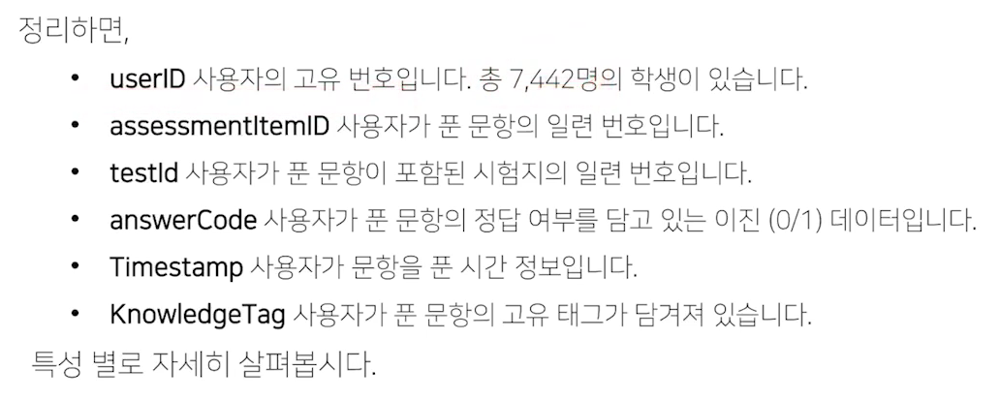
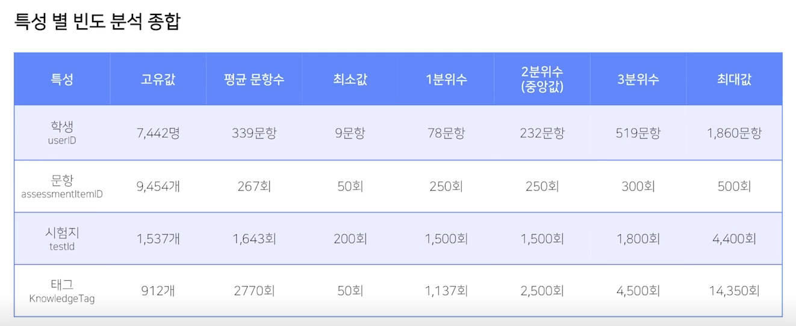
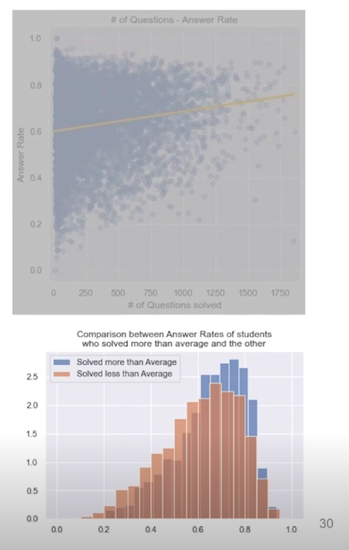
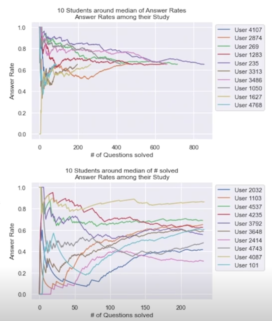
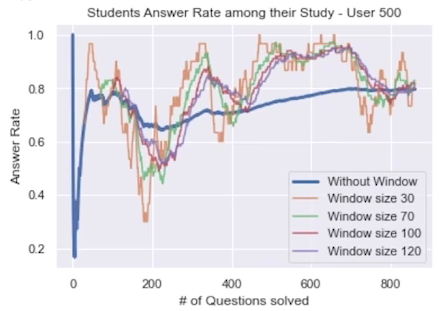

# 1. i-Scream 데이터 분석
## 1.1. 기본적인 내용 파악
* Timestamp의 이상함이 있을 수 있을 것이다.
* KnowledgeTag
  * 912개의 고유 태그가 존재, 일종의 중분류 역할, 문항 당 하나씩 배정되는 태그 

### AssessmentItemID
* 사용자가 푼 문항의 일련 번호로 총 10자리로 구성
* 첫 자리는 항상 알파벳 A
* 그 다음 6자리는 시험지 번호
* 마지막 3자리는 시험지 내 문항의 번호

### TestId
* 사용자가 푼 문항을 포함한 시험지의 번호로, 마찬가지로 10자리로 구성
* 첫 자리는 항상 알파벳 A
* 그 다음 9자리 중 앞의 3자리와 끝의 3자리가 시험지 번호
  * 앞의 3자리 중 가운데 자리만 1~9 값으로 가지며 나머지는 0 -> 이를 대분류라는 Feature로 활용
* 가운데 3자리는 모두 000으로 구성

## 1.2. 기술통계량 분석
### 기술통계량이란?
* 일반적으로 데이터를 살펴볼 때, 가장 먼저 살펴보는 것은 기술통계량입니다.
* 보통 데이터 자체의 정보를 수치로 요약, 단순화하는 것을 목적으로 하며
* 우리가 잘 알고 있는 평균, 중앙값, 최대/최소와 같은 값들을 뽑아내고, EDA 과정에서 이들을 유의미하게 시각화하는 작업을 거칩니다.
* 분석은 최종 목표인 정답률과 연관 지어 진행하는 것이 유리하다.

### 사용자 분석
* 한 사용자가 몇 개의 문항을 풀었는지 (보통 groupby 명령어를 통해 찾아낼 수 있습니다. 평균 339문항, 최소 9문항, 최대 1860문항) - histogram, distribution plot
  * 히스토그램의 단점은 binning에 따라 그림이 달라짐
  * distribution의 문제는, 데이터가 연속적인 경우 안 보일수도 있다. 
* 학생 별로 정답률이 어떻게 되는지 (평균 62.8%, 최소 0.0%, 최대 100.0%, 중앙값 65.1%)

### 문항 별 / 시험지별 정답률 분석
* 문항들의 정답률 추이가 어떻게 되는지, 평균 65.4%, 최소4%, 최대 99.67% 
* 시험지 별로 정답률이 어떻게 되는지 
  * 평균 62.8%, 최소 0.0%, 최대 100%, 중앙값 65.1%
  
### **추가적으로 해야할 것은?**
* 분류를 위한 EDA를 해야하거든요. 
* 모델의 성능을 올리기 위한 EDA는 어떻게 해야 할까?
* barpolot

## 1.3. 일반적인 EDA
### 단순 기술통계량을 넘어선 특성들과 정답률 사이의 관계 분석
* 실제로 정답률과 어떤 특성이 관계뙤는지 확인되기 위해서는 특성들의 대표성을 나타내는 기술통계량으로는 부족하다.
* 여러 가지 관련 지식과 경험으로, 데이터를 추가적으로 분석할 필요가 있다.
* 우리는 최종 목표를 잊지 말고, 어떻게 하면 정답률과 관계된 특성을 더 찾을 수 있는지 고민해보자.

### 문항을 더 많이 푼 학생이 문제를 더 잘 맞추는가?
* 일상생활에서, 우리는 더 많은 문제를 푼 학생이 공부량이 많기에 사실 여부와 관계 없이 시험을 더 잘 볼것이라고 기대합니다.
* 이후 슬라이드에서 제시되는 그래프는, 직접 실습으로 그려보는 것을 추천합니다.

### 더 많이 노출된 태그가 정답률이 더 높은가?
* 학생들이 더 많이 접한 태그들의 정답률이 높을지 확인.
* 어느 정도 더 자주 노출된 태그가 더 정답률이 높은 추세를 가지네요.
* 하지만 회귀선 중심으로 너무 값이 넓게 퍼져 있는 것 또한 유의해야 합니다.

### 문항을 풀 수록 실력이 늘어나는가?
* 전에 더 많은 문항을 푼 학생이 정답률이 높은가를 확인해봤는데 우리는 Sequence를 다루기 때문에, 문항을 풀수록 정답률이 상승하는가에도 관심을 두면 좋겠네요.
* 오른쪽 두 그래프는
  * 정답률이 중앙값 부근에 있는 10명의 학생의 문항갯수-정답률
  * 푼 문항의 개수가 중앙값 부근에 있는 10명 학생의 문항개수-정답률

* 정답률이라는 값이 (맞은 문항의 개수) / (푼 문항의 개수) * 100이다보니, 초반에는 값이 거의 1/0에 가깝다. 
* 초반에 문제를 잘 푼 학생들은 항상 감소하는 추세를 보이고, 반대의 경우는 증가하는 추세를 보이게 된다.
* 전체를 보기보단, 현재부터 앞의 N개 문항에 대한 정답률을 보면 나아질 것 같다.
* 500번째 사용자가 문항을 풀 수록 정답률이 증가하는가를 확인한 그래프입니다.
* Window Size는 앞의 N문항에 대한 정답률만 계산한다는 의미입니다.
* 전체 누적 정답률은 전반적으로 상승하는 추세를 확인할 수 있는데 Window를 달아보니 어느 구간에서는 정답률이 거의 1에 가깝고, 어떨 때는 정답률이 낮네요. 컨디션 난조일까요? 

### 문항을 푸는 데 걸린 시간과 정답률 사이의 관계는?

### 그 밖의 생각해볼 수 있는 것들
* 더 많이 노출된 시험지는 정답률이 높을까?
* 같은 시험지의 내용이나 같은 태그의 내용을 연달아 풀면 정답률이 오를까?
  * 비슷한 개념의 문항을 연달아 풀면 성취도가 올라가는 현상
* 정답을 특별히 잘 맞추는 시간대가 있을까?

---
# 2. Hands on EDA
## 2.1. 실제 코드로 살펴보기