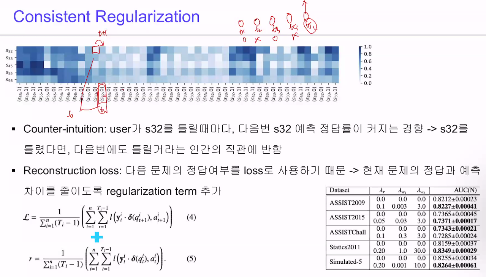
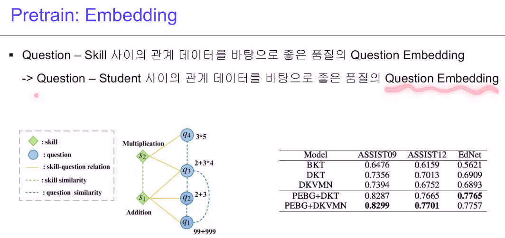

21년 논문입니다.

# 여러 실험적인 팁
* 다양한 DKT 연구에서 보고된 이야기들이 있습니다. 이론적으로 증명되기보다는, 실험적으로 알려진 팁들을 공유

## 언제나 최고인 모델은 없다.
* DKT에 활용되는 다양한 모델 소개
  * LSTM-DKT, DKVMN, GLR....
* 벤치마크 데이터셋마다 성능 높은 모델이 다르다.
* 모든 평가 지표에서 우위를 점하는 모델 또한 없다.
* 즉, 하나의 모델이 DKT Task를 평정하고 있지는 않다.
  * 다양한 모델로 실험해보기를 권장한다.

## AUC만 보는 것이 맞는가?
* 실제 대회의 순위는 AUC만으로 결정되지만, DKT 모델이 잘 작동하고 있는지 확인할 때 AUC만 보는 것이 맞는지는 재고해 봐야한다.
* AUC는 Binary classification에서는 좋은 메트렉일지 모르지만, 그렇지 않은 경우는 F1 을 봐야 하는 게 좋을지도?
* 정답의 분포를 고려했을 때 데이터 분포와 관계 없이 성능을 알려주는 지표는 AUC가 없다.
* 하지만 모델들이 서로 다른 지표에 대해서 우위가 다른 경우가 있기 때문에 여러 평가 지표를 활용해 비교해야 함.
* Yolo V5, iou + precision, recall을 보아서 최종 수치를 내려주기도 한다. 

## Hyperparameter Tuning
* 모델이 어느 정도 정해지고 나면, 더 최적의 성능을 찾기 위해 Hyperparameter tuning은 필수적이다.
* 특히 입출력 값을 어떻게 처리해주느냐에 따라서도 성능이 많이 달라진다.
* 실제 Review 논문에서 모델이 바뀌었을 때 성능 차이만큼, Hyperparameter tuning으로 인한 성능 차이도 유의미한 것으로 발견되었다. 
* 모델 별로 몇 가지 변화를 주며 성능을 확인해보았는 데 아래와 같다.
  * 입력값 처리 비교 : One-Hot vs Embedding
    * 입력 데이터 : 단순 원핫인코딩 vs 임베딩 벡터로 처리 (중요한 이슈!)
    * 실제로 SAKT 모델에서는 이 사용 여부가 굉장히 큰 차이를 가져오기도 했다.
* 한 학생이 푼 문항이 너무 많으면
  * 이것을 쪼개서 다른 데이터로 취급한다. (Split)
  * 최대 횟수를 넘어가는 횟수는 버린다. (cut)
* 이는 Transformer 계열 모델을 사용할 때 더더욱 필요한데, 계산 복잡도가 입력값의 길이 (seq_length) 제곱에 비례하는 것이 이유이다.
* 그 밖의 Hyperparameter도 최고 성능을 내는 조합은 같은 모델이더라도 데이터셋 별로 다른 것이 확인 

## 정리 
* 하나의 모델이 항상 최고의 성능을 보이는 것은 아니다.
* 평가 지표를 다양하게 사용해야 한다.
* 모델 갈아끼우는 것보다, hyperparameter tuning/ pre,post-processing이 중요하다.

## Forgetting Behavior : Time & Count
* RT (Repeated Time gap)
* ST (Sequence Time gap)
* TC () 

## Consistent Regularization

# Pretrain : Embedding 

* GNN에서 많은 성능향상을 보았던 팀은 없었긴 하다. 

## Shake-up 을 잘 해보도록 하세요.
* CV가 좋아야한다.
