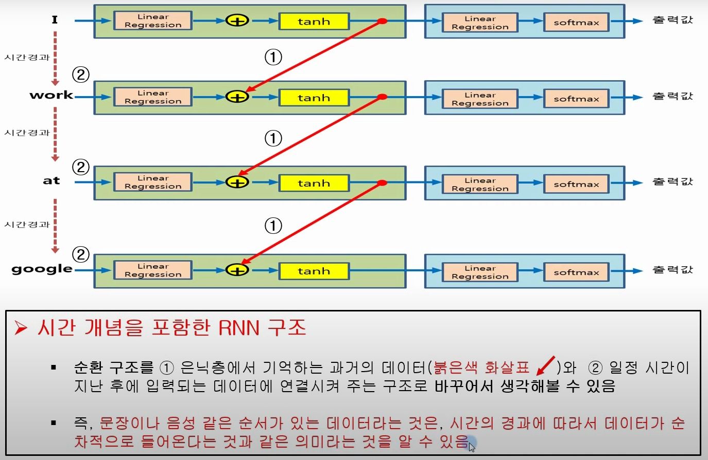
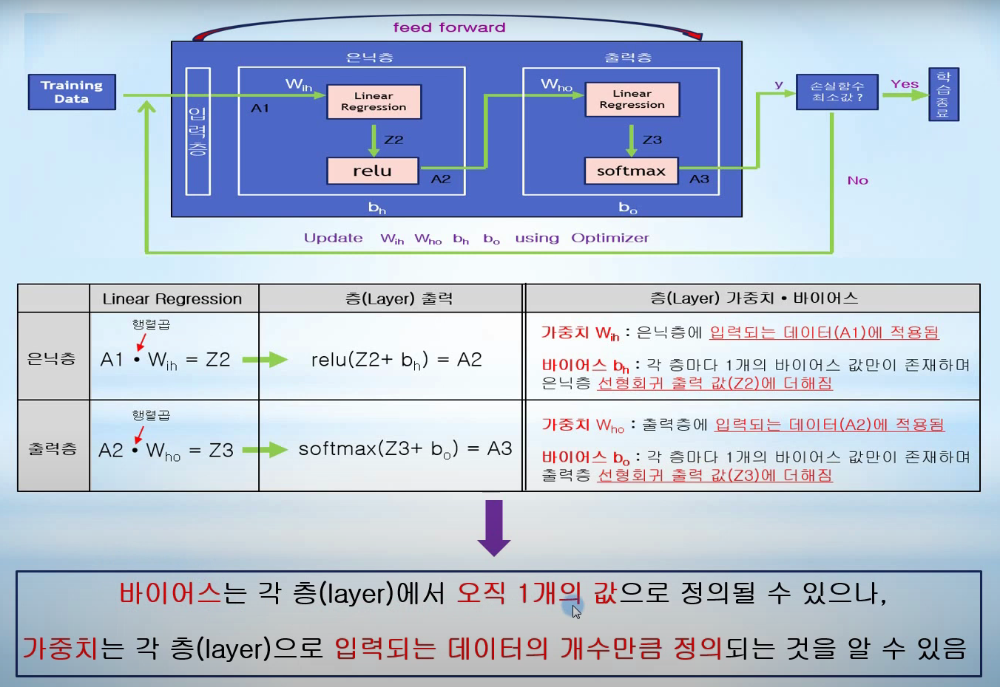
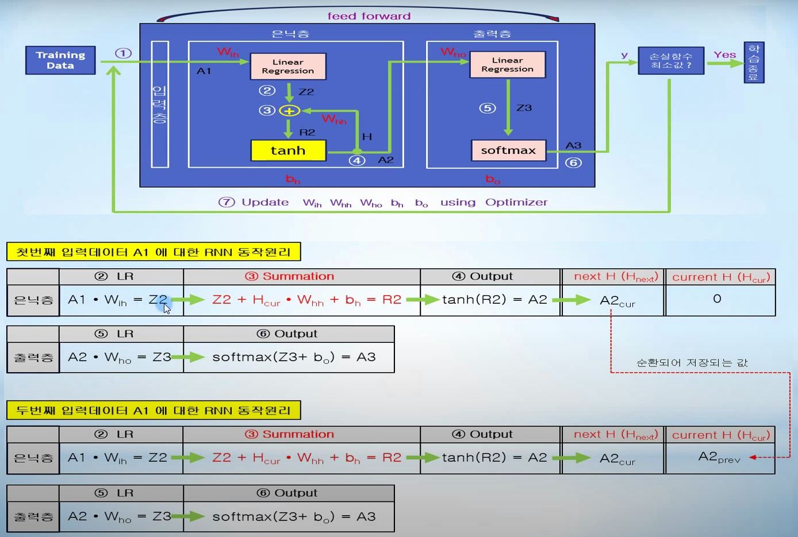
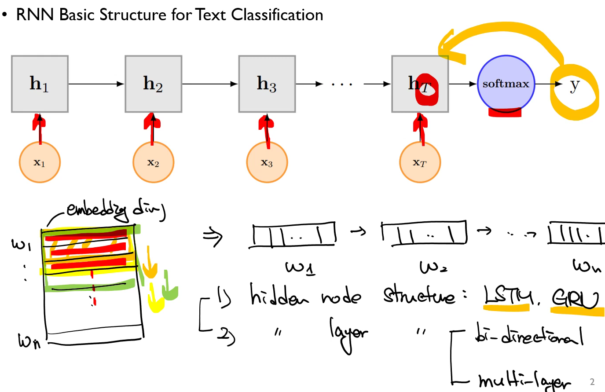
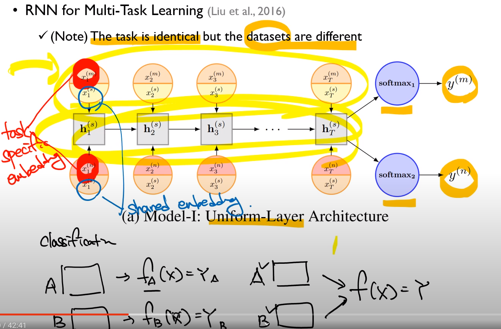
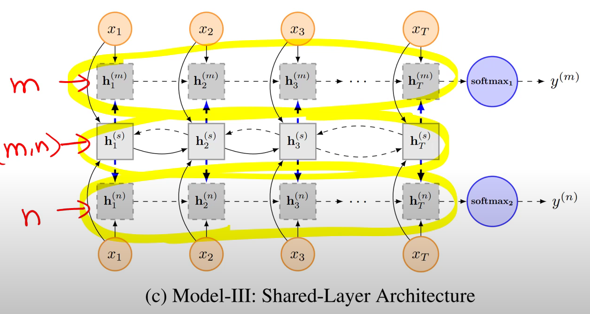
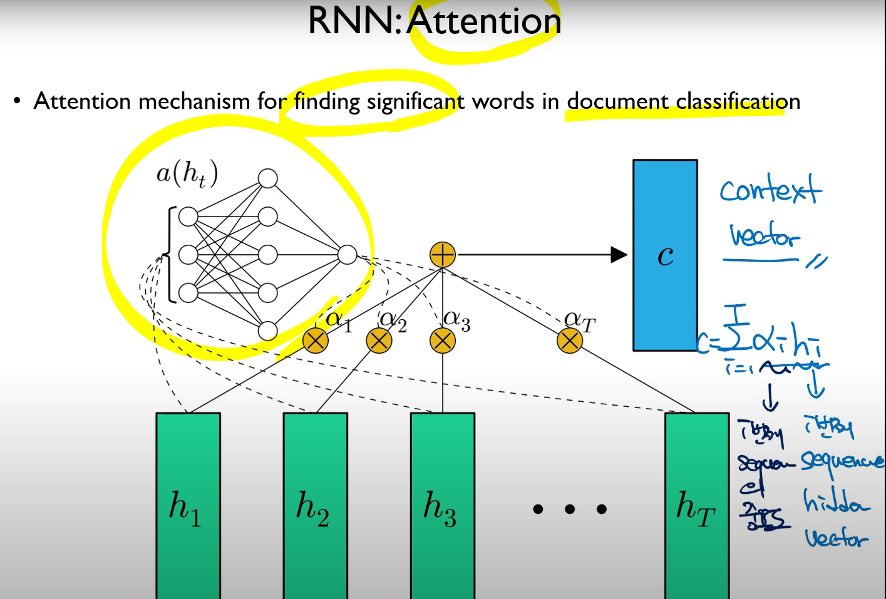

# RNN 

* 일반적인 NN Architecture 
* RNN Architecture 

* RNN의 출력은 다양한 형태가 될 수 있다.
* You might be wondering, which portion of the RNN do I extract my output from? This really depends on what your use case is. For example, if you’re using the RNN for a classification task, you’ll only need one final output after passing in all the input - a vector representing the class probability scores. In another case, if you’re doing text generation based on the previous character/word, you’ll need an output at every single time step. 

* Sequential Data를 처리하는 과정에서, 일찍 input된 데이터와 나중에 input된 데이터를 잘 반영할 수 있을까 고민하는 과정에서 나온 것입니다.
* 구조를 변형하기 + 문서를 잘 분류를 할 수 있을까 고민하는 과정에서 RNN for Multi-Task-Learning (Liu et al.,2016)
## RNN-Uniform-Layer Architecture 

## RNN-Coupled-Layer Architecture 

## RNN-Shared-Layer Architecture 

## RNN : Attention
* Attention mechanism for finding significant words in document classification 

* Two main attnetion mechanisms
  * Bahadanau attention
    * Attention socres are separated trained, the current hidden state is a function of the context vector and the previous hidden state
  * Luong attention
    * Attention scores are not trained, the new current hidden state is the simple tanh of the weighted concatenation of the context vector and the current hidden state of the decoder 

### Luong attention

LSTM은 RNN의 특별한 한 종류로, 긴 의존 기간을 필요로 하는 학습을 수행할 능력을 갖고 있다. LSTM은 Hochreiter & Schmidhuber (1997)에 의해 소개되었고, 그 후에 여러 추후 연구로 계속 발전하고 유명해졌다. LSTM은 여러 분야의 문제를 굉장히 잘 해결했고, 지금도 널리 사용되고 있다.

LSTM은 긴 의존 기간의 문제를 피하기 위해 명시적으로(explicitly) 설계되었다. 긴 시간 동안의 정보를 기억하는 것은 모델의 기본적인 행동이어야지, 모델이 그것을 배우기 위해서 몸부림치지 않도록 한 것이다!

모든 RNN은 neural network 모듈을 반복시키는 체인과 같은 형태를 하고 있다. 기본적인 RNN에서 이렇게 반복되는 모듈은 굉장히 단순한 구조를 가지고 있다. 예를 들어 tanh layer 한 층을 들 수 있다.

# Reference
1. https://dgkim5360.tistory.com/entryunderstanding-long-short-term-memory-lstm-kr
2. https://blog.floydhub.com/a-beginners-guide-on-recurrent-neural-networks-with-pytorch/

---

# Q1
RNN 모델은 hidden 값이 output으로 나간다는게 무슨 말이야? 출력층은 따로 존재하잖아. 

좋은 질문이에요! RNN (Recurrent Neural Network) 모델에서 hidden 값이 출력으로 나간다는 것은 hidden state 값이 출력층으로 전달되어 결과를 생성한다는 의미입니다. RNN은 시퀀스 데이터를 처리할 때 순차적으로 원소를 처리하면서 이전 시점의 정보를 현재 시점의 hidden state에 저장합니다.

RNN 모델의 구조를 자세히 살펴보면, 입력 데이터는 순차적으로 처리되고, 각 시점에서 hidden state가 업데이트됩니다. 이 hidden state는 다음과 같은 두 가지 목적으로 사용됩니다:

1. 다음 시점의 hidden state를 계산하기 위해 사용됩니다.
2. 현재 시점의 출력을 생성하기 위해 출력층으로 전달됩니다.

따라서, "hidden 값이 출력으로 나간다"는 것은 각 시점에서의 hidden state 값이 출력층에 전달되어 최종 결과를 생성한다는 것을 의미합니다. 물론 출력층은 따로 존재하고, 출력층의 활성화 함수와 가중치를 통해 최종 예측 결과가 만들어집니다.

# Q2
왜 굳이 Relu가 아니라 tanh를 사용하며, 출력층에서 출력을 해줄 때 softmax를 사용하는거야?

RNN에서 활성화 함수로 `tanh`를 사용하는 이유와 출력층에서 `softmax`를 사용하는 이유에 대해 설명하겠습니다.

1. `tanh` 사용 이유: RNN에서는 활성화 함수로 주로 `tanh`를 사용합니다. 이는 몇 가지 이유 때문입니다.

   - `tanh` 함수는 비선형이며, 실수 전체 범위에서 미분 가능한 S자 형태의 함수입니다. 이로 인해 모델이 더 복잡한 패턴을 학습할 수 있습니다.
   - `tanh` 함수의 출력 범위는 -1에서 1 사이입니다. 이 범위 안에서 출력값이 정규화되기 때문에, gradient vanishing 현상이 다소 완화됩니다.
   - `ReLU` 함수를 사용할 경우, 출력이 음수가 아니기 때문에 hidden state의 양수 음수 밸런스가 깨질 수 있습니다. 반면, `tanh`를 사용하면 양수와 음수 값 모두를 포함하기 때문에 시퀀스 데이터의 밸런스를 유지하는 데 도움이 됩니다.

2. 출력층에서 `softmax` 사용 이유: 출력층에서는 주로 다음과 같은 이유로 `softmax` 함수를 사용합니다.

   - 다중 클래스 분류 문제의 경우, `softmax` 함수를 사용하여 모델의 출력을 확률 분포로 변환할 수 있습니다. 이렇게 하면 각 클래스에 속할 확률을 쉽게 해석할 수 있습니다.
   - `softmax` 함수는 각 클래스에 대한 확률 값을 0과 1 사이로 정규화하며, 이들의 합은 항상 1이 됩니다. 이러한 특성 때문에 다중 클래스 분류 문제에 적합합니다.
   - `softmax` 함수와 크로스 엔트로피 손실 함수를 함께 사용하면, 모델이 학습하는 동안 확률 분포 간의 차이를 최소화할 수 있습니다. 이는 일반적으로 분류 문제에서 좋은 성능을 내는 방법입니다.

RNN에서는 활성화 함수로 `tanh`를 사용하여 시퀀스 데이터를 처리하고, 출력층에서는 다중 클래스 분류 문제에 적합한 `softmax` 함수를 사용하여 최종 예측을 수행합니다. 이렇게 각 함수가 선택되는 이유는 모델의 성능과 안정성을 높이기 위함입니다.

# Q3 
그럼 RNN 모델을 분류가 아니라 예측을 위해 사용할 때는 softmax를 사용할 필요가 없겠구나?

