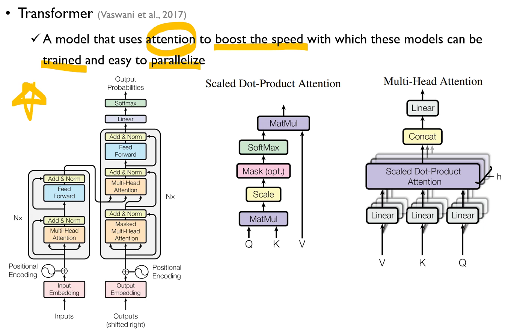

# Transformer : Self Attention
* 시퀀셜한 데이터 input을 받아서, transformer를 통과해서 output이 나오는 것이다. 지난 시간의 RNN 기반의 encoders, encoders 기반인 것은 비슷하다. 그러나 transformer의 내부를 보면 encoding component와 decoding conponents 가 따로 존재하고, 그걸 어떻게 연결시키는 지가 앞서 설명한 RNN과 다른 상황이 된다. 

## Encoder, Decoder
* 인코딩 부분은 Encoder의 stack이다. 여러 개를 쌓은 것이다. original paper는 6개의 stack을 쌓는다. (6개가 최적이라는 논리적인 근거는 없다.) 
* 디코딩 부분도 마찬가지로 encoder와 동일한 개수를 쌓는 것과 동일하다.
* 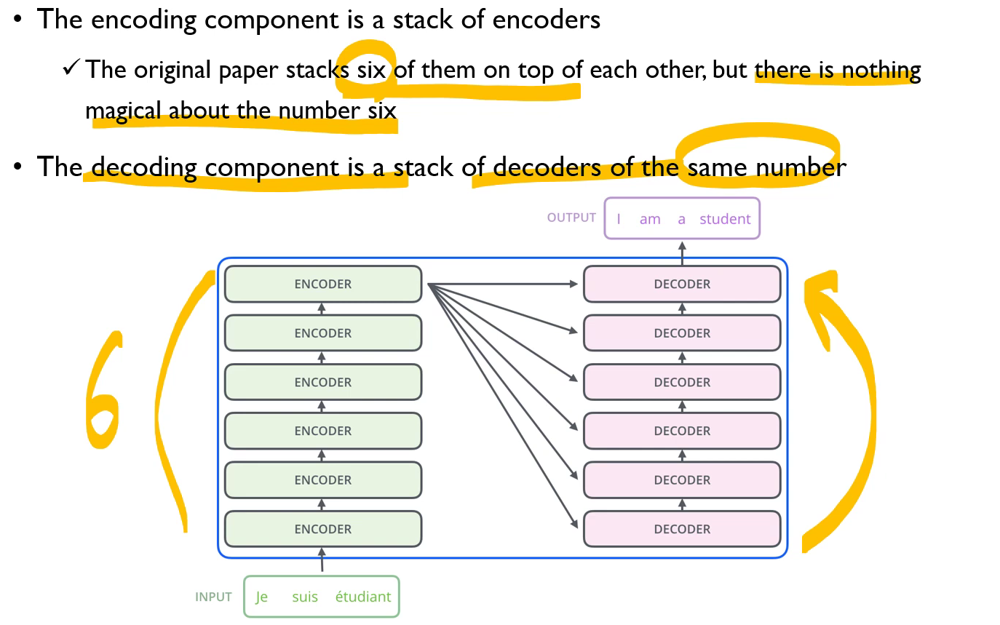

## Encoder, Decoder의 가장 큰 차이점
* Encoder는 한 번에 모든 seqeunce를 사용해서 mask를 사용하지 않는다.
* Decoder는 sequence를 생성해야하고, encoding에서 처리할 때는 한 번에 가져와도 되지만, decoding을 할 때는 뒷 단어를 먼저 만들고, 앞 단어를 만들 수는 없으니까 **Masking**에 대한 차이가 있다.
* Encoder는 2단구조이지만, Decoder는 3단구조이다.

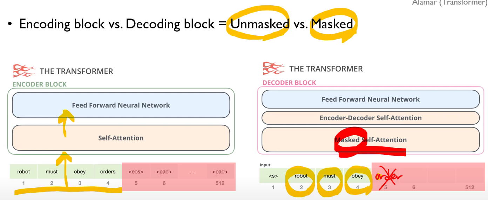

### Encoder 
* The encoder are all identical in structure (does not mean that they share the weights), each of which is broken down into two sub-layers
  * The encoder's input first flow through a self-attention layer(a layer that helps the encoder look at other words in the input sentence as it encodes a specific word)
  * The output of the self-attention layer are fed to a feed-forward neural network
    * The exact same feed-forward network is independently applied to each poistion
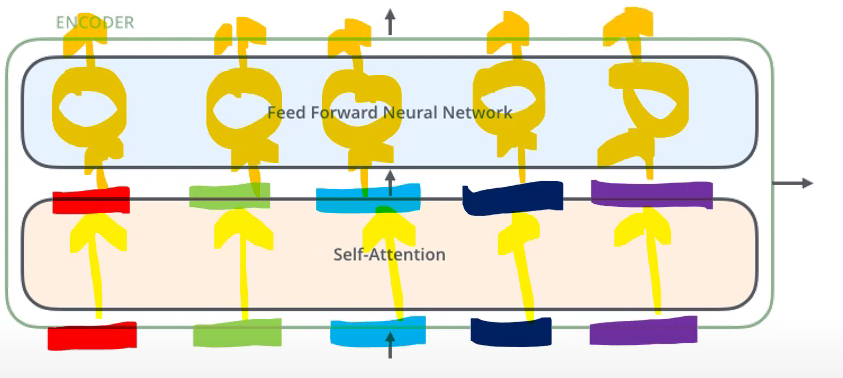

### Decoder 
* 디코더는 인코더에 비해서 하나의 sub-layer를 더 가지고 있다. 그것은 바로 Encoder-Decoder Attention이다.

## Input Embedding
* Let's begin by turning each input word into a vector using an embedding alogithm (ex - WordEmbedding, GloVe, FastText)
  * The embedding only happens in the bottom-most-encoder 
  * The abstraction that is common to all the encoders is that they receive a list of vectors each of the size 512
  * In the bottom encoder that would be the word embeddings, but in other encoders, it would be the output of the encoder that is directly below (어차피 Encoder가 다음 Encoder한테 넘겨주므로, input embedding을 할 때, hidden 차원이랑 동일하게 차원을 맞춰주면..?)
  * The size of this list is a hyperparameter we can set - basically it would be the lenghth of the longest sentence in our training dataset (가장 긴 seqeunce로 무엇을 할 것인지가 중요하다. 가장 긴 문장? 패딩이 많이 발생할 것이므로, 상위 95% 문장? 이런식으로 결정해야한다.)

## Positional Encoding
* RNN이나 LSTM같은 경우는 시퀀스에 포함 되어 있는 단어마다, 위치 정보를 자동으로 포함하고 있지만 sequence를 한 번에 넣어버리면 위치가 인식되지 않는다. 따라서 언제 들어왔는지에 대한 정보가 필요하다. 이것이 바로 Positional Encoding.
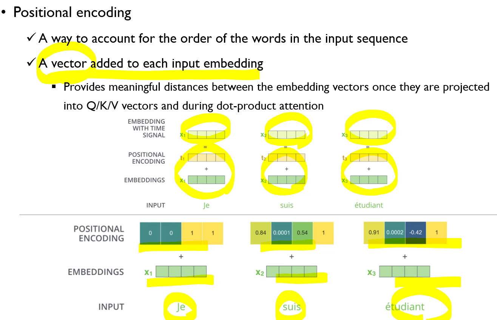
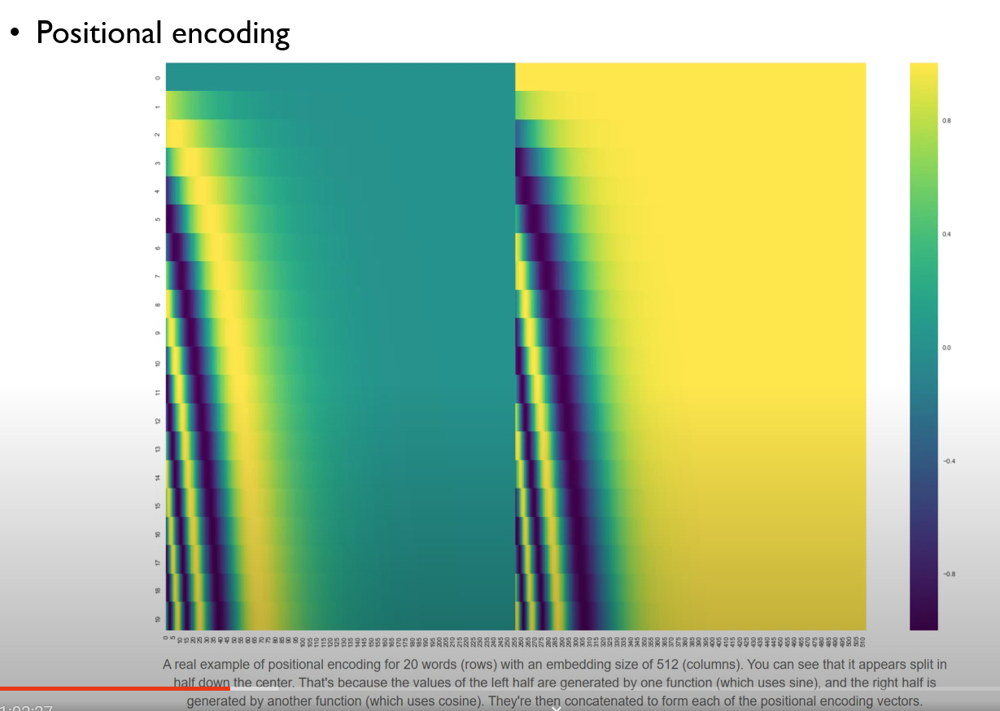

* Two properties that a good positional encoding scheme should have
  * The norm of encoding vector is the same for all positions
  * The further the two positions, the larger the distance 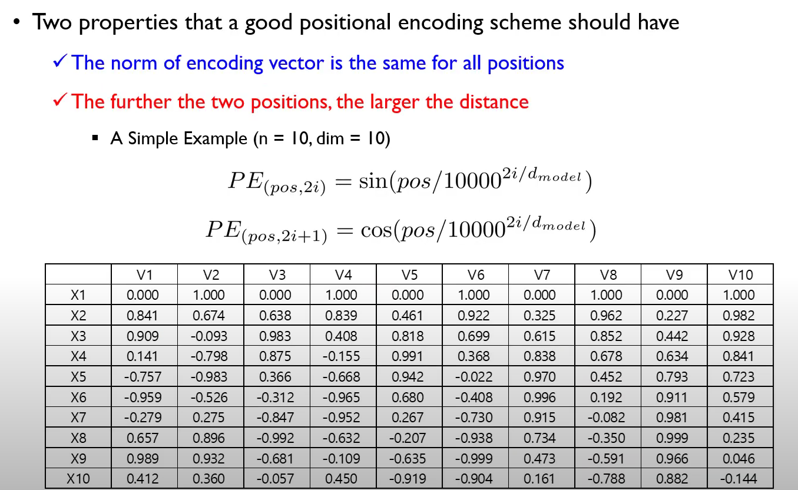 
### Positional Encoding을 하는 이유
* 모든 시퀀스를 한 번에 입력으로 받기 때문에, 단어가 가지고 있는 위치 정보를 고려하지 못한다는 것이 단점
* 그래서 위치 정보를 최대한 반영해줄 수 있는 어떤 장치를 마련하자는 것이다.
* 그 장치가 Positional Emcoding인데, 그 식은 다음과 같다. 
$$
PE_{(pos,2i)}=sin\left( \dfrac{pos}{10000^{\frac{2i}{d_{model}}}} \right)\\
PE_{(pos,2i)}=sin\left( \dfrac{pos}{10000^{\frac{2i}{d_{model}}}} \right)
$$
* 도대체 이것이 갖는 목적이 무엇이냐?
  1. 해당하는 인코딩 벡터 자체의 크기는 동일해야한다. 그것이 1norm 이든 2norm이든, word embedding에 똑같은 크기로 더해줘야지만이 동일한 벡터 혹은 크기가 같은 벡터가 더해지니까, 모든 워드들이 같은 방향 또는 같은 크기로 변화한다는 보장을 할 수 있겠지요.
  2. Positional Encoding이 갖는 크기 자체가 서로 달라서는 안된다. 각각의 위치에 따라 달라서는 안된다.
  3. 말 그대로, 위치 관계를 표현하고 싶은 것이니까, 두 단어의 거리가 실제로 input seqeunce에서 멀어지게 되면, positional encoding 사이의 거리도 멀어져야한다. 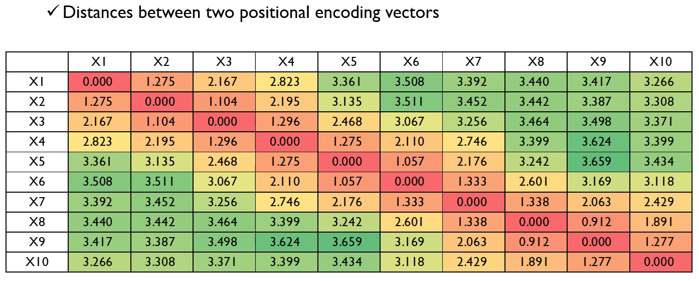 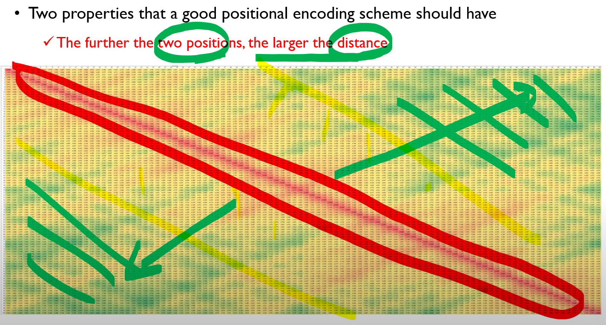 - 실제로 완벽하게 거리를 반영해주지는 못했다. 

## Multi-Head-Attention 
* 핵심은, Self-Attention에서는 서로 서로 의존적인 부분이 있지만, feed-forward layer does not have those dependencies (parallelization becomes possible)
* self-attention은 dependency가 있고, feed-forward layer는 토큰마다 dependency가 없다. 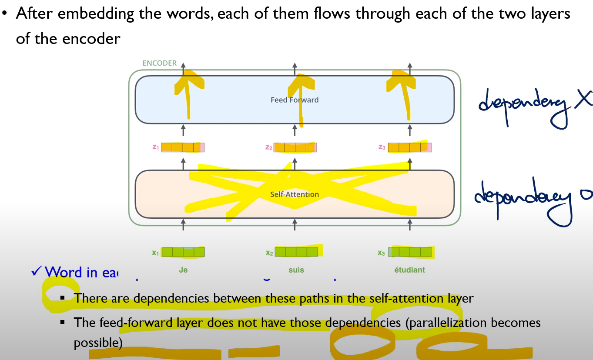 - dependency가 있다는 것은 서로 연관성이 있다는 것이다. 
* 
* ~~위의 둘은 structure는 같지만, weight들은 달라질 수 있다. 차원의 수들은 같겠지만, weight는 따로 계산되어야 할 것이다.~~
* 같은 Encoder1 내에서 FFN의 계수들은 구조도 같고, Weight도 같다. 그러나 Encoder2에서는 구조는 같겠지만 Weight가 다를 것이다.

### Self-Attention Detail

Step1 : Create three vectors from each of the encoder's input vectors

* 세 종류의 벡터를 만들건데, Query는 현재 내가 보고 있는 단어의 representation이다. 다른 단어들을 scoring 하기 위한 기준이 되는 것이다. 현재 프로세싱하고 있는 단어들에 대한 쿼리만을 신경쓰게 되는 것이고
* Key같은 경우에는, 좋은 예시인데, 마치 우리가 가지고 있는 label과도 같은 역할을 수행한다. query가 주어졌을 때, key부터 찾는 것이다. key는 file들에 해당하는 identity가 될 것이고, 실제 value에 대한 것은 value vector가 될 것이다. value가 실제 값일 것입니다.
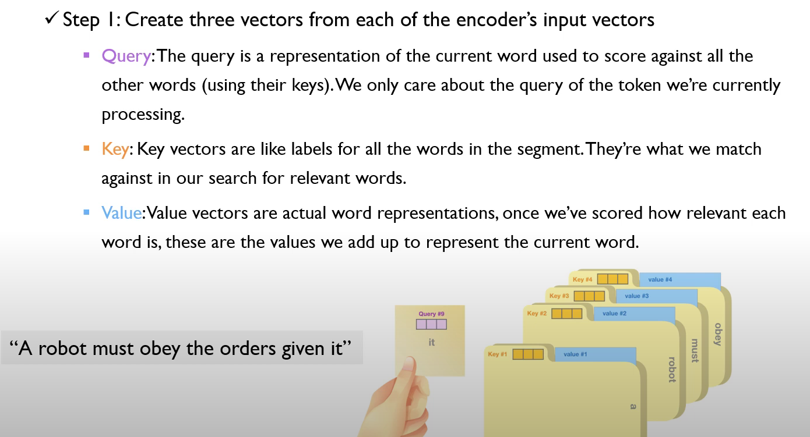
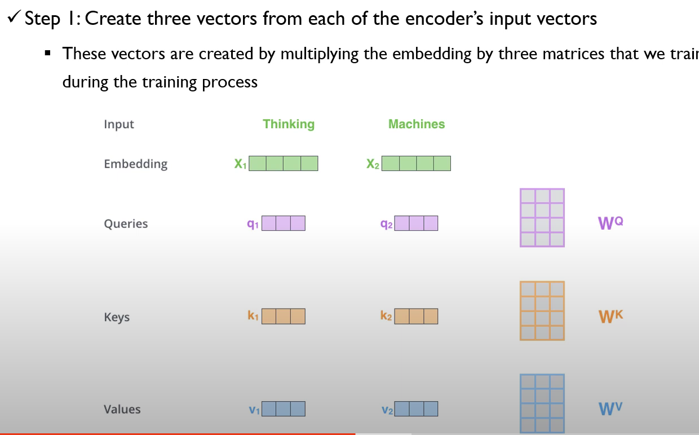
* 우리는 $W^{Q}, W^{K}, W^{V}$를 찾아야한다. 
* 일반적으로는 우리는 Q,K,V의 dimension을 input/output vectors에 비해서는 적게 잡는다. 
그 이유는 Multi-Head-Attention의 관점에서! 이 MHA를 통과한 벡터들을 전부 Concat해서 encoder 또는 decoder의 output으로 사용하거든요? 그래서 concat을 시켰을 때, 다시 512가 만들어지도록 하는 것이 좋지 않겠느냐.
 $512=64\times8$ 여기에서 8이 multihead-attention의 차원이 될 것이다. 

Step2 : Calculate a score, i.e., how much focus to place on other parts of the input sentence as we encode a word at a certain position

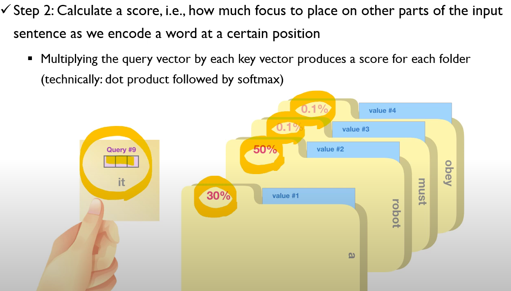
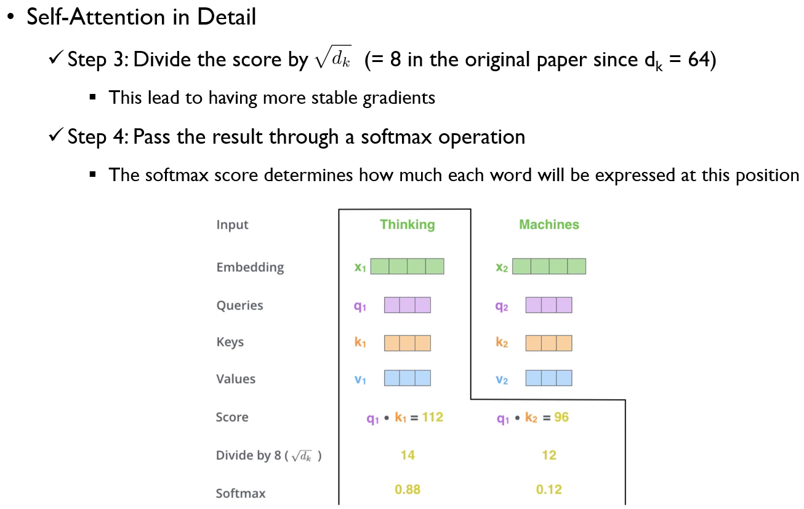 
* 왜 $\sqrt{d_k}$로 나누냐면, gradients를 더 안정적으로 만든다는 결과가 있습니다.
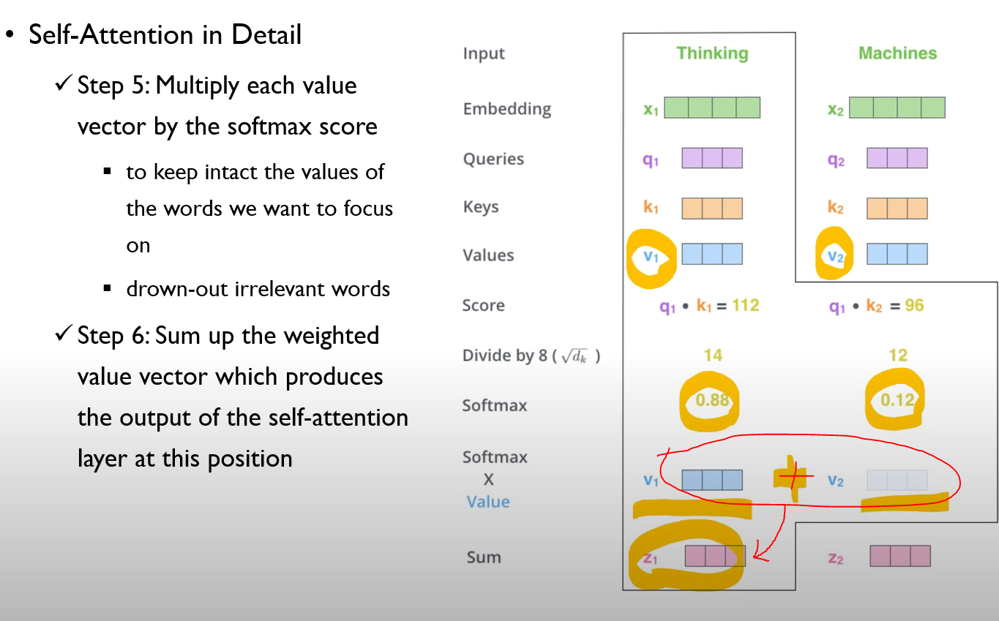
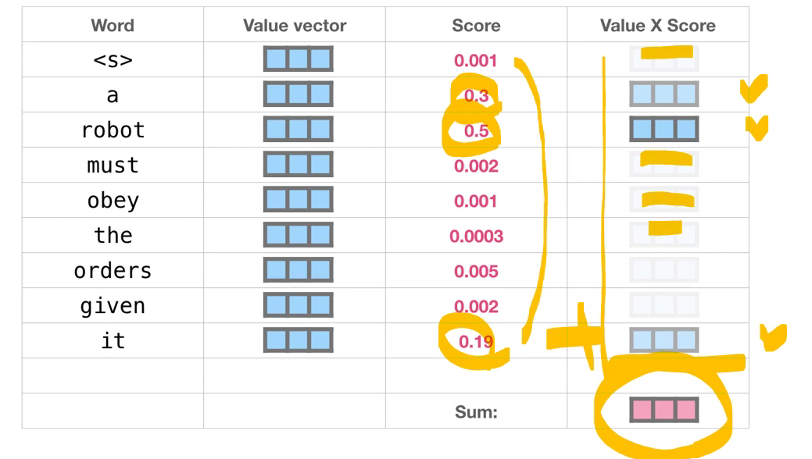
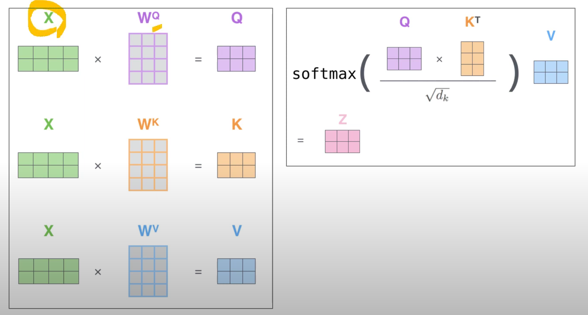
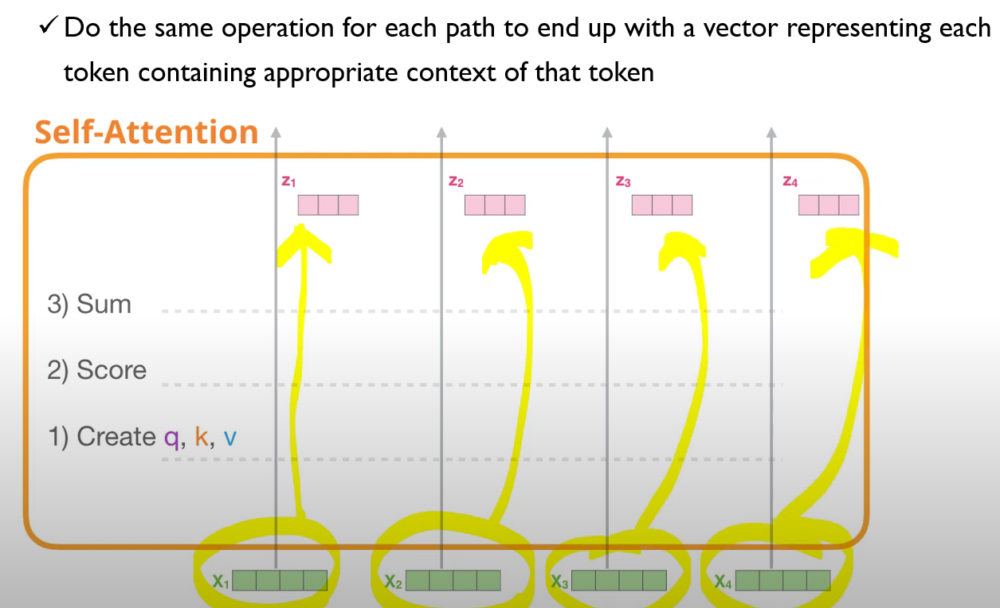

### Multi-headed attention

지금까지는 Single Attention을 이야기했는데, 예시에서 it이 가장 연관성이 깊은 단어를 '하나'만 허용할 것이 아니라, MultiHead, 즉 여러 경우를 허용하겠다. 그래서 Attention Head를 여러 개 두겠다.

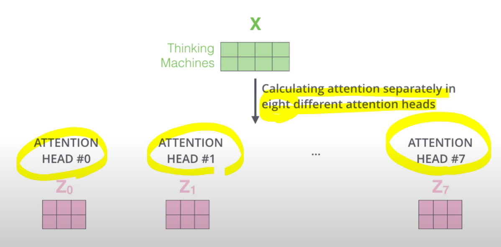
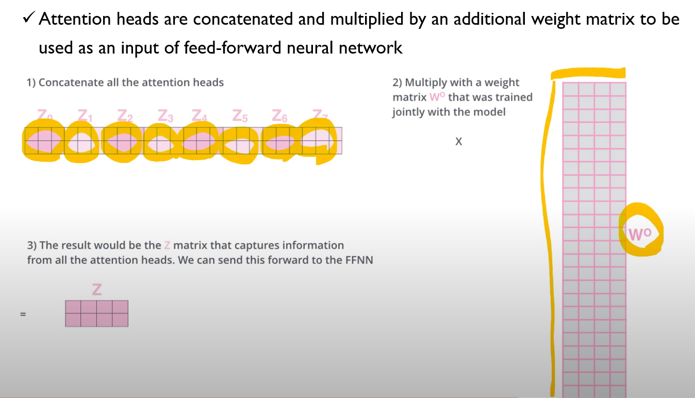
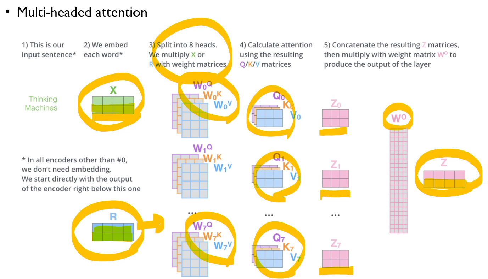
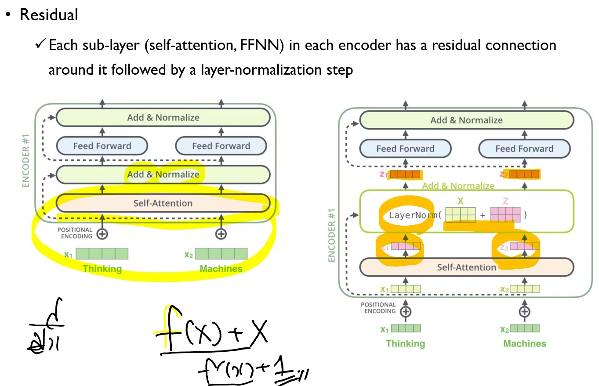

## Residual connection & Normalization 
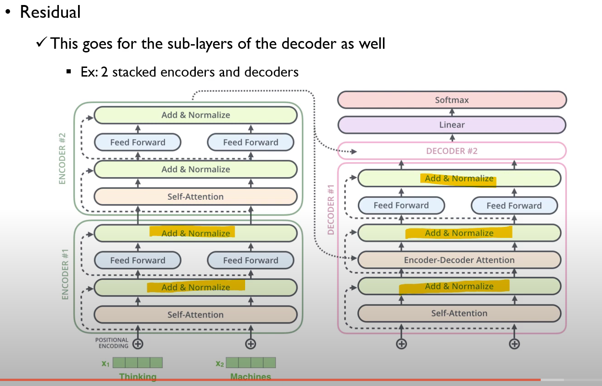
* $f$를 Self-Attention에 대한 함수라고 치면, $X$를 넣었을 때, $f\left( X \right)$가 나오겠지. 그런데, $\frac{df(X)}{dX}$를 계산했을 때 $0$이 나오면 그래디언트 전달이 잘 안될 것이니까 적어도 $f\left( X \right)+X$를 해주면 미분했을 때 gradient가 $1$은 전달되지 않겠느냐. 

## Position-wise Feed-Forward networks 
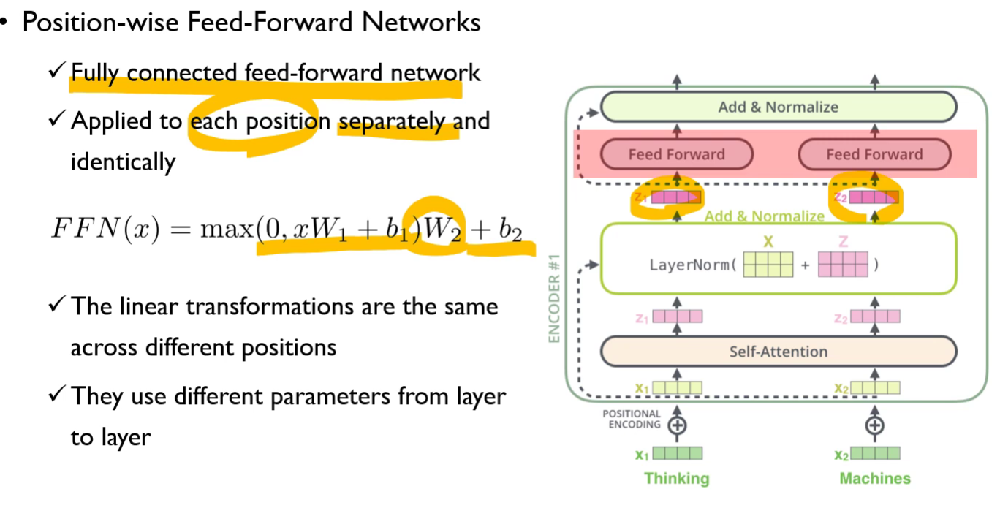
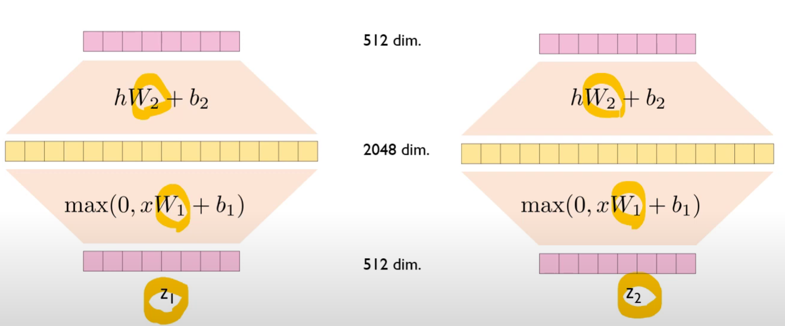