# 최신 자연어 번역(언어 모델)의 동향
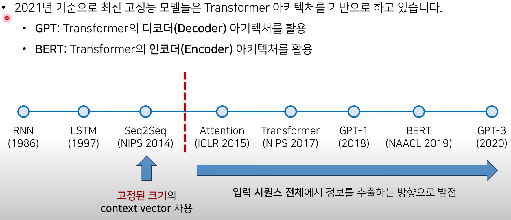

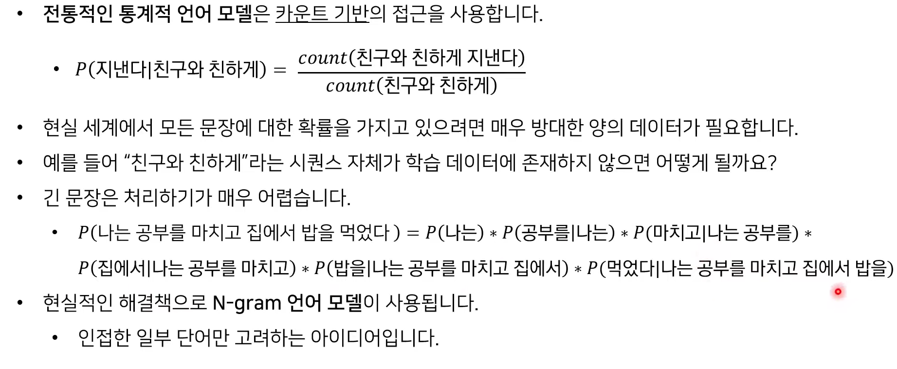

# Seq2Seq

* 인코더와 디코더로 구성됐다
* 인코더 RNN은 입력된 소스 문장을 인코딩하고 디코더 RNN은 이를 컨디션으로 target 문장을 생성하는 역할을 한다.
* 학습시에는 실제 타겟 문장의 단어가 다음 단어의 예측을 위해 디코더의 입력의 일부로 사용되지만 테스트 시에는 타겟 문장이 주어지지 않는다고 가정하고, 각 스텝별 예측된 단어가 다음 스텝의 입력으로 사용된다는 차이가 있다.
* 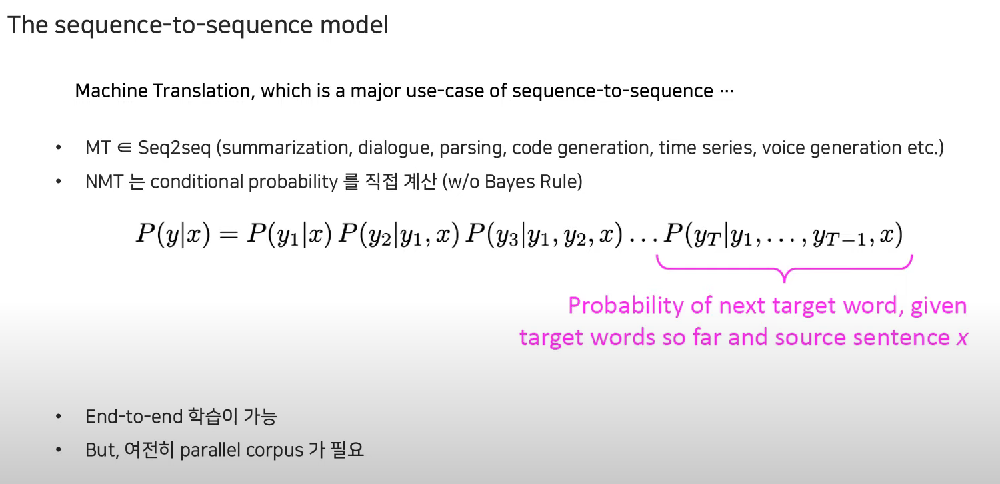
* 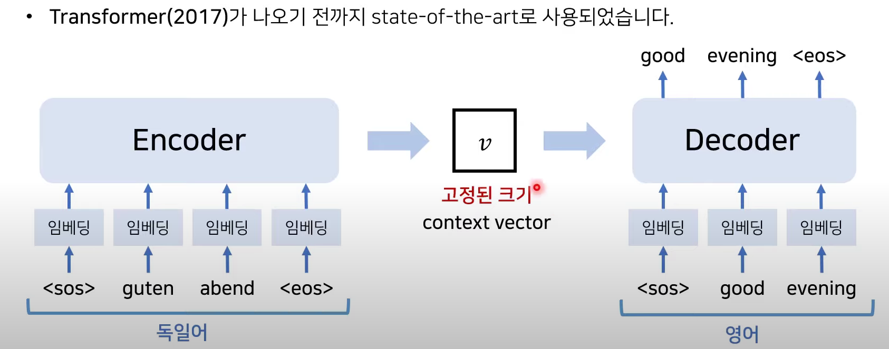
* 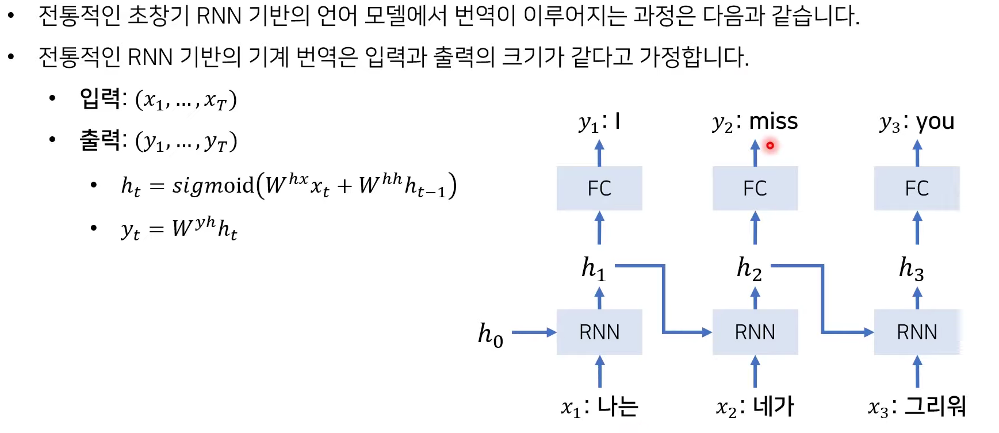
* 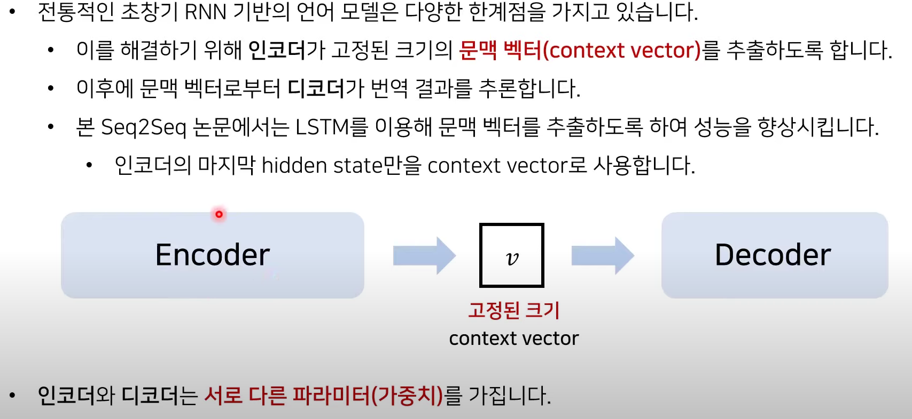
* 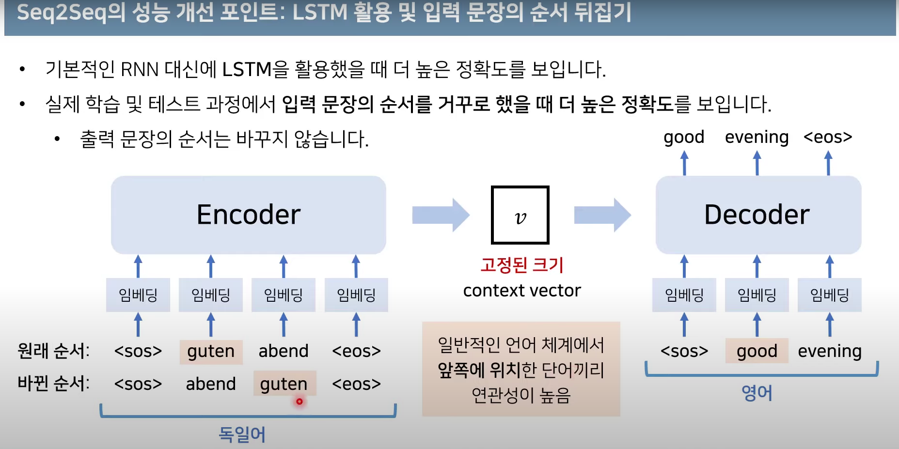

## 성능을 높이기 위해 노력한 부분
* padding을 최대한 덜 하도록 노력하였음
* 문장의 정보를 뒤집어서 시도해보았음.

## NMT 모델이 학습되는 방법
* 인코더와 디코더를 아래와 같이 도식화했을 때, 디코더의 각 스텝별 output은 타겟 문장의 한 단어를 생성하게 됩니다. 생성된 단어와 실제단어와의 NLL (Negative Log Likelihood)를 계산하여 loss로 사용되고, 이때 NLL Loss는 0에서 1까지의 범위의 확률값을 0에서 무한대로 mapping하여 backpropa를 사용하는 NN의 Loss minimization 문제를 풀기 위해 사용된다. 
* 앞서 보여드린 모델은 가장 간단한 형태의 NMT 모델이었는데 성능 향상을 위해서는 많은 RNN layer를 쌓은 Multi-layer RNNs 구조를 사용한다. 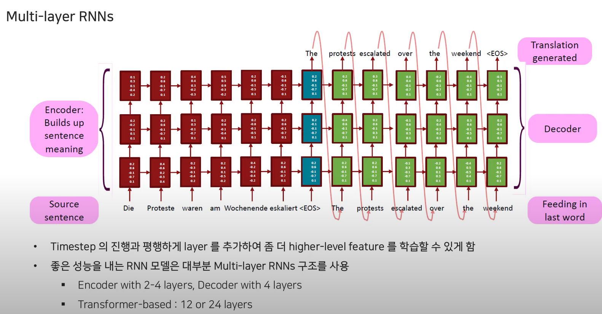
* RNN에서 사용하는 Multi layer는 일반적인 NN나 CNN에서처럼 깊은 구조를 사용하진 않는다. 이후 제안되는 Transformer에선 12~24개를 사용한다.

## NMT의 디코딩 방식
* 단순하게는 Exhaustive 방식을 사용할 수 있겠지만, 이는 너무 계산량이 많이 들기에 step별 probability argmax word를 사용하는 **greedy decoding**방식을 사용할 수 있다. 그러나 이는 이미 선택한 단어를 이후 단어와의 조합을 생각하여 번복할 수 없기 때문에 부자연스러운 문장이 생성될 수 있다. 
* 그래서 일반적으로는 **Beam search decoding** 방식이 사용된다. 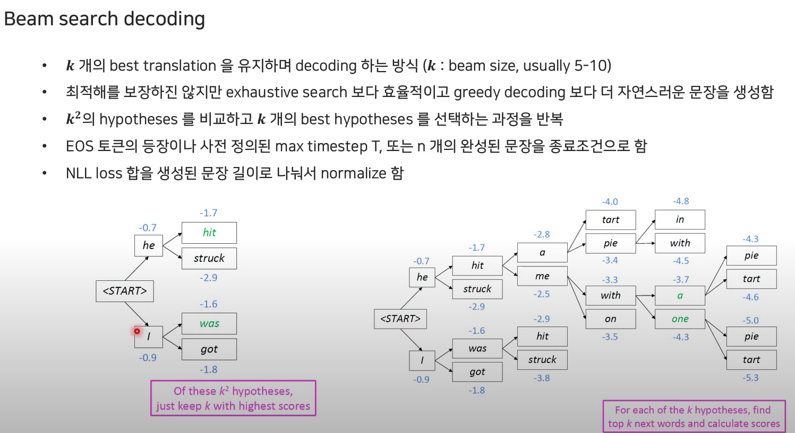

### Seq2Seq의 단점
* context vector의 크기가 고정되어있기 때문에 문장에 대한 정보를 모두 담아야하기 때문에, context vector가 문장에 대한 정보를 모두 담지 못하면 한계가 있다.
---

# Attention
## The bottleneck problem
* 일반적인 인코더, 디코더의 문제는 인코더의 마지막 문장만을 디코더에 넘겨주기 때문에 아쉬운 점이 있다.적절한 번역문을 생성하려면 인코딩이 소스 문장에 필요한 모든 정보를 담고 있어야하는데, 대부분의 경우 그러기에 충분하지 않기에 여기에서 bottleneck 문제가 발생합니다.

## Attention
* Bottleneck 문제를 해결하기 위해 제안됨
* Decoder의 각 스텝에서 source sentence의 특정 부분에 집중할 수 있도록 Connection 추가 
  1. Encoder의 step별 encoding과 decoder hiddenstate의 유사도를 계산하여 attention score와 attention weight(probability)를 계산한다.
  2. Attention distribution을 사용해 encoder hidden state를 가중합하여 attention output을 계산한다.
  3. Attention output과 decoder hidden state를 concat하고 해당 step의 word를 생성한다.
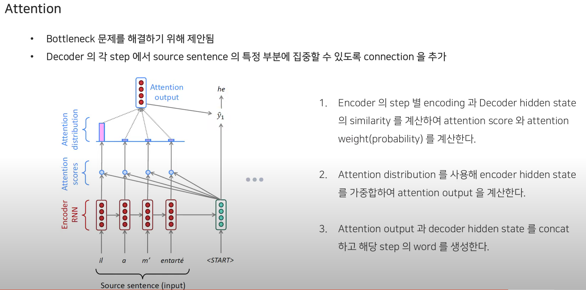
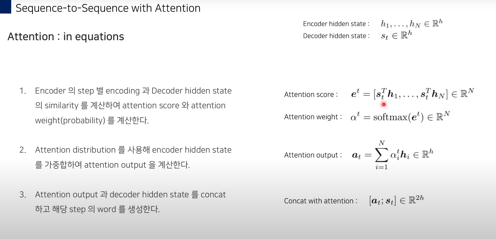

## Attention is great
* NMT의 성능 향상 : decoder가 source sentence의 특정 영역에 집중할 수 있게 함
* Source sentence의 모든 embedding을 참고하는 구조를 사용하여 일반적인 Encoder-Decoder 구조의 bottleneck 문제를 해결함
* Shortcut 구조를 사용하여 Vanishing gradient 문제를 줄임
* Alignment를 스스로 학습할 수 있고 attention probability를 통해 결과에 대한 interpretability를 제공함

## Attention is general Deep Learning technique
* Transformer에 대한 개념을 보면 key, query, value 개념을 도입
* Attention output 계산을 위한 가중합은 value (encoder hidden state)가 가지는 정보의 선별적 사용으로 해석할 수 있고, query(decoder hidden state)는 이 정보가 어디에 집중할 지를 결정한다.
* 또한 attention은 입력문장의 인코딩을 글로벌하게 반영하면서, Attention은 query에 dependent한 **고정된 크기**의 value representation을 얻을 수 있는 방법이다.
* 이때 고정된 크기는 입력문장의 길이와 관계가 없다는 뜻으로 이해하면 될 것이다.